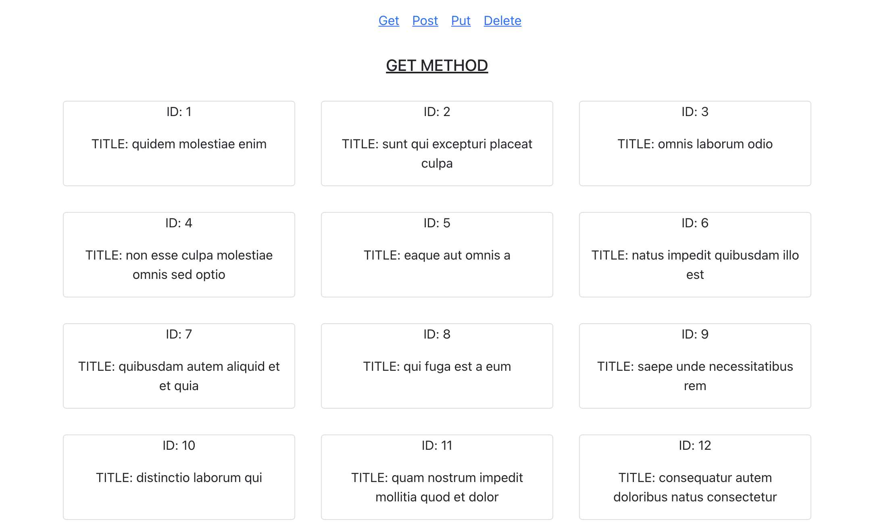
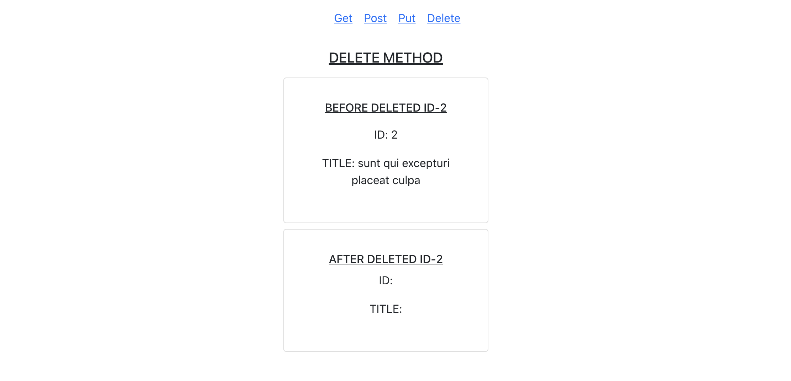

# REACT ALBUMS

It is an album react app where you can use GET, POST, PUT, DELETE METHOD on a URL, and it displays all the data on the frontend depending on the METHOD.

## Table of contents

- [Overview](#overview)
  - [Available Scripts](#available-scripts)
- [Folder Structure](#folder-structure)
  - [Screenshot](#screenshot)
  - [Links](#links)
- [My process](#my-process)
  - [Built with](#built-with)
  - [What I learned](#what-i-learned)
  - [Useful resources](#useful-resources)
- [Author](#author)
- [Acknowledgments](#acknowledgments)

## Overview

It is a React App where we learn to utilise the Create, Read, Update, Delete Method in Fetch API. It enables us to understand the most common features used in big apps like Facebook, Youtube, etc. We can post, edit, delete and update messages.

### Available Scripts

In the project directory, you can run:

`npm start`

Runs the app in the development mode.\
Open [http://localhost:3000](http://localhost:3000) to view it in the browser.

The page will reload if you make edits.\
You will also see any lint errors in the console.

## Folder Structure

    - src/components
            - DeleteAlbums.js
            - GetAlbums.js
            - Navbar.js
            - PostAlbums.js
            - PutAlbums.js
        - App.js

### Screenshot

- Get Method
  
- Post Method
  
- Put Method
  
- Delete Method
  

### Links

- Live Site URL: [Live Website](https://kurosakicoder.github.io/ReactAlbums)

## My process

First, I used the Fetch API method to display the data on the front end. Then I used Bootstrap and Vanilla CSS to style the data.

### Built with

- JSX
- CSS
- Bootstrap
- ReactJS

### What I learned

I learn how we can update data from the front end using the Fetch API

```js
useEffect(() => {
  fetch("https://jsonplaceholder.typicode.com/albums/2", {
    method: "PUT",
    body: JSON.stringify({
      title:
        "Learn Javascript because it is incredible as I wrote this through the FETCH PUT method",
      userId: 1,
    }),
    headers: {
      "Content-type": "application/json; charset=UTF-8",
    },
  })
    .then((response) => response.json())
    .then((data) => setPutValue(data));
}, []);
```

### Useful resources

- [JSON PLACEHOLDER](https://jsonplaceholder.typicode.com/guide/)

## Author

- LinkedIn - [Khaidem Sandip Singha ](https://www.linkedin.com/in/khaidemsandip/)
- Twitter - [@KurosakiCoder](https://twitter.com/KurosakiCoder)

## Acknowledgments

I have done this project from scratch by referencing the websites that I mentioned.
